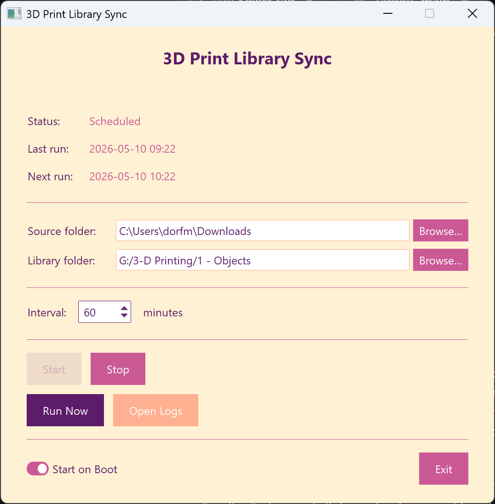

# 3D Print Library Sync

[](https://github.com/dorfman2/3d-print-library/actions/workflows/test.yml)

Automatically moves new 3D print files from a watched **Source folder** (your
`Downloads` by default) into an organised **Library folder** (`%USERPROFILE%\3D
Prints` by default) — clean folder names, no duplicates, no leftover ZIPs. Both
folders are configurable from the tray app's control window, along with the
category list and per-category keywords.

Two entry points:

| Script | Purpose |
|--------|---------|
| `sort_downloads.py` | CLI — dry-run or live sync |
| `sort_downloads_app.py` | Windows system-tray app — scheduled sync with GUI controls |

---

## Quick Start

```powershell
pip install -r requirements.txt
python sort_downloads.py          # dry run — preview what would happen
python sort_downloads.py --move   # execute
python sort_downloads_app.py      # launch tray app
```

---

## What the Sync Does

Five phases run in order:

1. **Pre-process Downloads ZIPs** — extracts ZIPs in place; deletes redundant ZIPs
   that already have an extracted folder alongside them.
2. **Build library index** — scans the library to collect every existing project name
   for duplicate detection.
3. **Collect & categorise** — identifies folders and loose print files in Downloads,
   cleans their names, assigns a category, skips known duplicates.
4. **Move to library** — executes the moves; logs every action.
5. **Clean library ZIPs** — extracts and removes any ZIPs that snuck into the library.

See [sort_downloads_requirements.md](sort_downloads_requirements.md) for the full
specification: name-cleanup rules, category keywords, dry-run output format, etc.

---

## Tray App



```powershell
python sort_downloads_app.py             # open window + tray icon
python sort_downloads_app.py --minimized # tray icon only (used by autostart)
```

The control window lets you:
- Pick the **Source folder** to watch (defaults to `%USERPROFILE%\Downloads`)
- Pick the **Library folder** to organise into (defaults to `%USERPROFILE%\3D Prints`,
  auto-created on first save)
- Edit **Categories** — add / rename / delete category folders and their keyword
  lists; renames move the on-disk folder, deletes move children to `Uncategorized`
- Start / Stop the scheduler (interval 1–1440 minutes)
- Run Now on demand
- Open Logs
- Toggle "Start on Boot" (writes/removes a Windows Registry autostart entry)
- Exit

Config is saved alongside the executable: app preferences in
`sort_downloads_config.json`, editable category list in `categories.json`
(seeded from the bundled `categories.default.json` on first launch).

---

## Installer (1.1.0)

A pre-built installer ships at `dist\3DPrintSync-Setup.exe`:

- Per-user install to `%LOCALAPPDATA%\3DPrintSync` — no admin / UAC prompt
- Optional Desktop and Start Menu shortcuts (off by default)
- Always-present Start Menu **Uninstall** entry, plus an Add/Remove Programs entry
- Bundles Python and all dependencies — nothing else to install

## Building the Installer

Produces a self-contained `dist\3DPrintSync-Setup.exe` — no Python required on the
target machine.

**Prerequisites (dev machine only):**

```powershell
pip install -r requirements.txt -r requirements-dev.txt
# Download and install Inno Setup 6: https://jrsoftware.org/isinfo.php
```

**Build:**

```powershell
python build_installer.py
```

Runs `pytest`, then PyInstaller (`sort_downloads_app.spec`), then Inno Setup
(`installer.iss`).  A failing test aborts the build before any installer
artefact is produced.

---

## Tests

```powershell
pip install -r requirements-dev.txt
pytest -v
```

The suite uses real files on `tmp_path` — no mocks (per the project's
[python-prefs.md](.claude/rules/python-prefs.md) rule).  GitHub Actions runs
the same tests on `windows-latest` for every push and pull request.

---

## Dependencies

| Package | Use |
|---------|-----|
| `ttkbootstrap` | Themed tkinter widgets |
| `pystray` | Windows system-tray icon |
| `Pillow` | Icon image compositing |
| `pyinstaller` | Build-time only — bundling |

---

## Library Structure

```
1 - Objects/
  0 - Calibration/
  Uncategorized/
  1 - Machines/
  2 - Home and Household/
  3 - Office/
  4 - Tools and Organization/
  5 - Repairs and Replacements/
  6 - Electronics/
  7 - Gifts and Toys/
  8 - Models and Display/
  9 - Tabletop/
  10 - RC Flight/
  11 - MultiBoard/
  12 - MMU/
  13 - NERF/
  14 - Legos/
  15 - Cosplay/
```

---

## File Reference

| File | Purpose |
|------|---------|
| `sort_downloads.py` | Core sync logic — all 5 phases |
| `sort_downloads_app.py` | Tray GUI app |
| `sort_downloads_app.spec` | PyInstaller build spec |
| `installer.iss` | Inno Setup 6 installer script |
| `build_installer.py` | One-command installer build |
| `requirements.txt` | Python runtime dependencies |
| `requirements-dev.txt` | Dev-only dependencies (pytest) |
| `sort_downloads_requirements.md` | Detailed feature specification |
| `sort_downloads_config.json` | Runtime app config (gitignored) |
| `categories.json` | Runtime editable categories (gitignored; seeded on first launch) |
| `categories.default.json` | Bundled default category list — seeds new installs |
| `sort_downloads.log` | Runtime log — 5 MB rotating (gitignored) |
| `tests/` | pytest suite (real-filesystem integration tests) |
| `.github/workflows/test.yml` | CI — pytest on `windows-latest` for every push/PR |
| `3d-modeling.png` | Master icon art (source for `app-icon-100.png` / `app-icon.ico`) |
| `app-icon-100.png` | Tray and window icon (100×100, white-bg composited) |
| `app-icon.ico` | Multi-size .ico for the .exe, installer, and shortcuts |

---

## Credits

Icon: **"3d-modeling"** by **dickprayuda** (Flaticon).
